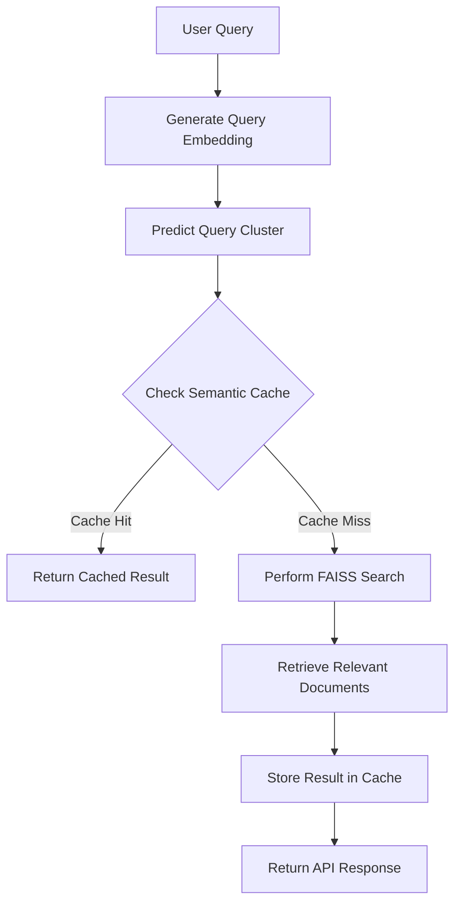
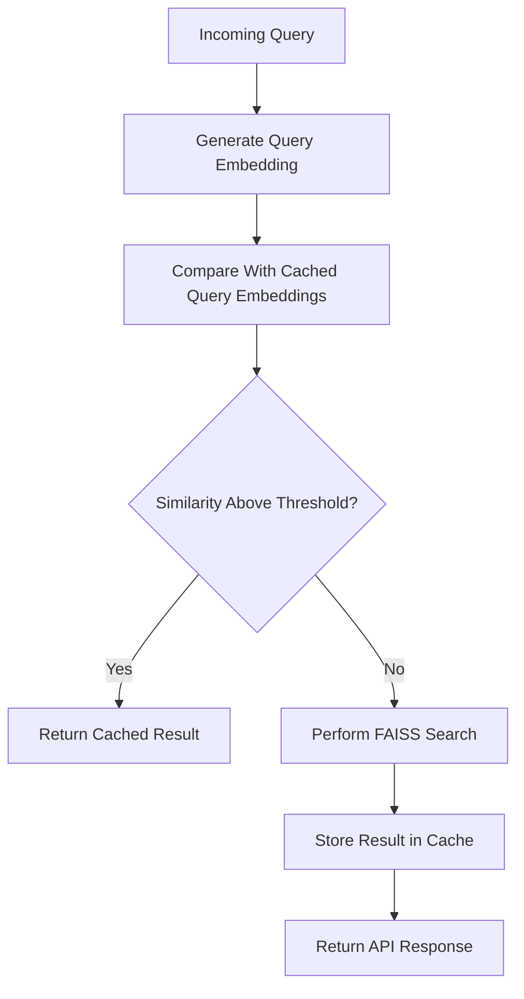

# Cluster-Aware Semantic Search System

## Project Overview

This project presents a **semantic document retrieval system** designed to find relevant text based on meaning instead of exact keyword matches.

The solution integrates multiple machine learning and NLP techniques including:

- **Sentence embeddings** for semantic representation
- **FAISS vector search** for efficient similarity retrieval
- **Fuzzy clustering** for topic grouping
- **Semantic caching** to accelerate repeated queries

The system is deployed as a **REST API using FastAPI**, allowing users to submit natural language queries and retrieve semantically related documents.

During development and testing, the API was temporarily exposed to the internet using **ngrok tunnels**, which allowed remote testing while the server was running locally.

---

## System Architecture

The system processes user queries through several stages before returning the most relevant documents.

**User Query**  
→ **Generate Query Embedding**  
→ **Determine Dominant Cluster**  
→ **Semantic Cache Lookup**  
→ **FAISS Vector Search (if cache miss)**  
→ **Retrieve Similar Documents**  
→ **Store Result in Cache**  
→ **Return Response via FastAPI**

---

## Architecture Diagram



---

## Repository Structure

```
trademarkia-semantic-search/

app/
│
├── __init__.py
├── app.py → FastAPI application entry point
│
└── utils/
    ├── __init__.py
    ├── engine.py → Core semantic search logic
    ├── embeddings.py → Sentence embedding utilities
    ├── cache.py → Semantic caching module
    └── precompute_embeddings.py → Script to generate embeddings

data/
│
├── raw/
│
├── processed/
│   ├── raw_documents.csv
│   ├── cleaned_documents.csv
│   ├── filtered_documents.csv
│   └── documents_with_clusters.csv
│
└── artifacts/
    ├── document_embeddings.npy
    ├── faiss_index.bin
    ├── cluster_centers.npy
    └── cluster_membership.npy

notebooks/
│
└── pipeline.ipynb → Experimentation and development notebook

Other files

Dockerfile
docker-compose.yml
requirements.txt
.gitignore
LICENSE
README.md
```

---

# Complete System Pipeline

The system follows a structured **machine learning pipeline**, starting with raw data preparation and ending with a deployed API service.

---

# 1. Dataset Collection

The project uses the **20 Newsgroups dataset**, a commonly used dataset in natural language processing research.

The dataset contains approximately **20,000 news posts** grouped into **20 different discussion categories**.

Some example topics include:

- Politics
- Religion
- Computer hardware
- Sports
- Space technology
- Firearms

Each document is originally stored as **plain text files**, which must be processed before they can be used for machine learning tasks.

---

# 2. Data Preprocessing

The original dataset includes various forms of **noise and non-content information**, such as headers and formatting symbols.

Before generating embeddings, a preprocessing pipeline was applied to clean and standardize the text.

Common issues in the raw dataset include:

- Email headers
- Formatting characters
- Punctuation symbols
- Stopwords

Removing these elements improves the **quality of semantic representations** produced later in the pipeline.

### Preprocessing Steps

The following transformations were performed during preprocessing:

- Convert all text to lowercase
- Remove punctuation and special characters
- Remove stopwords
- Remove email metadata
- Normalize whitespace

### Generated Intermediate Files

Several intermediate datasets are produced during preprocessing:

**raw_documents.csv** → structured dataset extracted from raw files  
**cleaned_documents.csv** → text after cleaning operations  
**filtered_documents.csv** → final dataset used for embedding generation  

Very short or noisy documents were removed to maintain **high-quality input for the embedding model**.

---

# 3. Document Embedding Generation

To perform semantic search, each document must be converted into a **dense numerical vector representation**.

These vectors capture contextual meaning rather than simple keyword frequency.

### Embedding Model

The project uses the **Sentence Transformers** framework.

Model used:

**all-MiniLM-L6-v2**

Library used:

**sentence-transformers**

Embedding dimension:

**384**

Each document is encoded into a **384-dimensional semantic vector** that captures its contextual meaning.

### Generated Artifact

```
document_embeddings.npy
```

This file stores the embeddings for every document in the dataset.

---

# 4. Vector Database using FAISS

Searching through thousands of embeddings requires an efficient similarity search system.

To achieve this, the project uses **FAISS (Facebook AI Similarity Search)**.

### Technology Used

FAISS vector similarity library.

### Index Type

Flat L2 Index.

FAISS enables **fast nearest-neighbor search** across high-dimensional vectors.

When a query embedding is generated, the FAISS index retrieves the most similar document embeddings.

### Generated Artifact

```
faiss_index.bin
```

This binary file contains the **pre-built vector search index** used by the API.

---

# 5. Fuzzy Clustering of Documents

Documents in real-world datasets often relate to multiple topics simultaneously.

For instance, a document discussing **firearms regulation** may be related to both **politics** and **weapons policy**.

Because of this, traditional **hard clustering algorithms like K-Means** are not always ideal.

Instead, the project applies **Fuzzy C-Means clustering**.

### Algorithm Used

Fuzzy C-Means

### Library

```
scikit-fuzzy
```

### Key Concept

Unlike hard clustering, fuzzy clustering assigns **probability-based membership** to clusters.

Example:

Document A:

Cluster 1 → 0.2  
Cluster 3 → 0.7  
Cluster 7 → 0.1

This allows documents to belong to **multiple topics with varying degrees of relevance**.

### Generated Artifacts

```
cluster_centers.npy
cluster_membership.npy
```

These artifacts help determine cluster relationships during query processing.

---

# 6. Semantic Cache Design

Traditional caching mechanisms depend on **exact string matching**, which is ineffective for natural language queries.

Example:

"How do graphics cards work?"

vs

"Explain GPU architecture"

Although these queries mean the same thing, a keyword-based cache would treat them as separate requests.

To address this, the project implements a **semantic cache**.

### Core Idea

Instead of comparing raw text, queries are compared using **vector similarity**.

### Cache Workflow

When a query is received:

1. Convert the query into an embedding
2. Compare it with cached query embeddings
3. If similarity exceeds a predefined threshold → cache hit
4. Otherwise perform FAISS vector search

Search results from cache misses are then stored in the cache for future use.

### Additional Optimization

The predicted **dominant cluster** of the query is used to restrict cache search space, improving lookup speed.

### Cache Metrics

The system records several cache statistics:

- Total cache entries
- Cache hits
- Cache misses
- Cache hit rate

---

# Semantic Cache Workflow



---

# 7. FastAPI Service

The semantic search system is deployed as a **RESTful API** using FastAPI.

### Framework

**FastAPI**

### ASGI Server

**Uvicorn**

### Implemented Endpoints

**POST /query**

Accepts a natural language query and returns relevant documents.

Example response:

```json
{
  "query": "...",
  "cache_hit": true,
  "matched_query": "...",
  "similarity_score": 0.91,
  "result": "...",
  "dominant_cluster": 3
}
```

---

**GET /cache/stats**

Returns statistics related to the semantic cache.

Example:

```json
{
  "total_entries": 42,
  "hit_count": 17,
  "miss_count": 25,
  "hit_rate": 0.405
}
```

---

**DELETE /cache**

Clears all stored cache entries and resets cache metrics.

---

# Running the Project

Install dependencies:

```bash
pip install -r requirements.txt
```

Start the FastAPI server:

```bash
uvicorn app.app:app --host 0.0.0.0 --port 8000
```

Open the API documentation:

```
http://localhost:8000/docs
```

---

# Docker Deployment

Build Docker image:

```bash
docker build -t semantic-search-api .
```

Run container:

```bash
docker run -p 8000:8000 semantic-search-api
```

---

# Author

**Sk Salma**  
B.Tech Computer Science (AI & ML)  
2027 Graduate
VIT-AP University
